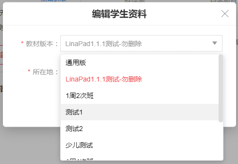
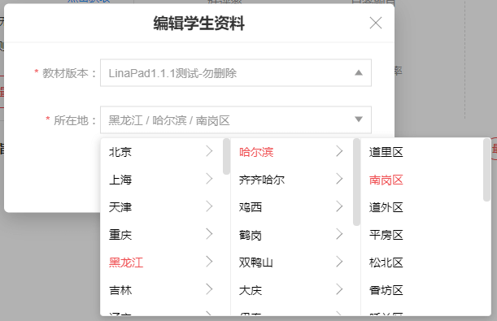

# Dropdown 

下拉选项，可配置联级数目

后期可根据需求扩展（禁选，点击事件等）

### shortscreen

 

### props 

```js
Dropdown.propTypes = {
  placeholder: PropTypes.string,        // input 的 placeholder
  popupZIndex: PropTypes.number,        // 弹出层的zIndex
  options: PropTypes.oneOfType([PropTypes.object, PropTypes.array]), // 待选数据
  onChange: PropTypes.func,             // 选中事件 接收一个数组参数 依次为每一个联级选中的结果
  cascader: PropTypes.number,           // 联级数目， 默认 1， 宽度与输入框宽度一样， 多联级的每个宽度150px
  autoSelect: PropTypes.bool,           // 初始化后是否自动触发一次 onChange (将初始数据与 options数据同步)    false 则不触发onChange
  props: PropTypes.shape({              // 数据结构，
    value: PropTypes.string,                // value 为 选择项目的值（'id',或其他唯一标识符键值)
    label: PropTypes.string,                // label 为 该项展示的值 （'label', 'name' 或其他键值）
    children: PropTypes.string,             // children 为 该项的子节点的键值 （'children', 'options' 等）
  }),                                       // 默认值为 { value: 'value', label: 'label', children: 'children' }
}
```

### example

```js
<Dropdown
  options={provinceCity}
  value={selectedEdition}
  placeholder="请选择"
  onChange={(option) => console.log(option)}
  cascader={3}
  props={{
    value: 'id',
    label: 'name',
    children: 'options',
  }}
/>

// provinceCity
[
  {
    id: 1,
    name: '北京',
    options: [
      {
        id: 2,
        name: '北京',
        options: [
          {
            id: 3,
            name: '东城区',
          },
          ...
        ]
      },
      ...
    ]
  },
  ...
]
```