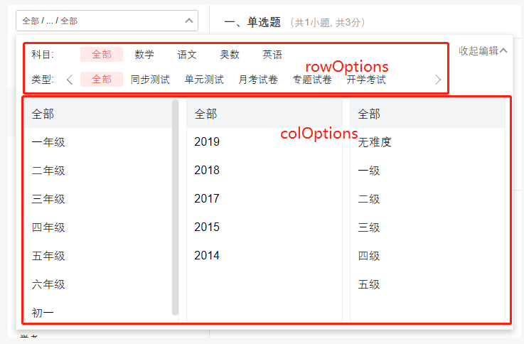

# Select



文件 | 功能
--- | ---
ColSelector.js | 纵向选择器
RowSelector.js | 横向选择器
SelectPanel.js | 选择器面板
LineScrollSelector.js | 水平滚动选择器
SelectInput.js | 输入框 *可自定义, 作为 children 传入*

## index.js 

```
Select.defaultProps = {
  prefixCls: 'select',
  customLabel: 'name',
  customValue: 'id',
  rowOptions: fromJS([]),
  colOptions: fromJS([]),
  onSelect: function(key, result, type, close) {
    console.warn(`component Select fired default props func: onSelect(${key}, ${toString(result)}, ${type}, ${toString(close)})`)
  },
  popupRef: () => {},
  popupClassName: '',
  children: SelectInput,
  placeHolder: '请选择...',
}
Select.propTypes = {
  prefixCls: PropTypes.string,
  selected: PropTypes.instanceOf(Immutable.Map),
  defaultSelected: PropTypes.instanceOf(Immutable.Map),
  customLabel: PropTypes.string,
  customValue: PropTypes.string,
  rowOptions: PropTypes.instanceOf(Immutable.List),
  colOptions: PropTypes.instanceOf(Immutable.List),
  onSelect: PropTypes.func,
  placeHolder: PropTypes.string,
  popupRef: PropTypes.func,
  popupClassName: PropTypes.string,
  children: PropTypes.oneOfType([PropTypes.element, PropTypes.func]),
}
```

- selected, defaultSelected  已选择的  `{ gradeId: { name: '一年级', id: 11 } }`
- customLabel 要展示的字段名,  默认 `'name'` 键名 *取 '一年级'*
- customValue 选择的唯一标识,  默认 `'id'`  键名 *取 11*
- rowOptions 横向滚动选择器数据,  按顺序从上到下展示  非必传
- colOptions 纵向并列选择器数据,  按顺序从左到右展示  非必传
- onSelect 选择方法  `function(key, selected, type, close) {}`
  - key 选择内容的标识, 依上例为 `'gradeId'`
  - selected 最终选择的内容, 依上例为 `{ name: '初一', id: 15 }`
  - type 字符串 标识选择的哪个选择器 `'colSelect' | 'rowSelect'`
  - close 关闭 popup 选择面板的方法
- placeHolder 未选择且没有默认值时的展示字符 用于input
- popupRef 弹出的选择面板 ref
- popupClassName 弹出面板的 classname 名
- children 选择出发器 输入框
  - PropTypes.element react组件   
    默认 `<SelectInput selectPath onClick open prefixCls placeHolder />`
    - props `{ selectPath, onClick, open, prefixCls, placeHolder }`
  - PropTypes.func 方法返回jsx    
    `function({ selectPath, onClick, open, prefixCls, placeHolder }) { return <div><div> }`
    - selectPath `{ textPath: '数学/.../苏教版', titlePath: '数学/一年级/苏教版', arrayPath: ['数学', '一年级', '苏教版']}` // 选择的结果
    - onClick   // 该事件用于 popup 的弹出操作
    - open   boolean 是否 popup 出选择面板， 用于确定popup状态
    - prefixCls SelectInput组件使用的
    - placeHolder 输入框的 placeholder

> selected defaultSelected 选择的数据
```
{
  gradeId: { name: '一年级', id: 11},
  subjectId: { name: '数学', id: 34 },
  ... 
}
```

> rowOptions colOptions 所有的筛选内容
```
[
  {
    name: '年级',
    id: 'gradeId',  // onSelect 返回的key
    options: [{name: '一年级', id: 11}, ...],
  }
  ...
  {
    name: '科目',
    id: 'subjectId',
    options: [{name: '数学', id: 34}, ...]
  }
]
```
