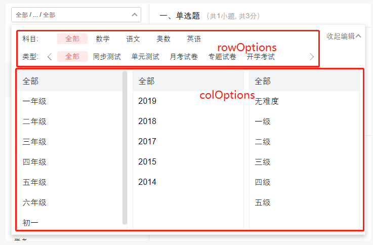

# ZmSelect



文件 | 功能
--- | ---
ColSelector.js | 纵向选择器
RowSelector.js | 横向选择器
SelectPanel.js | 选择器面板
LineScrollSelector.js | 水平滚动选择器

## index.js 

```
ZmSelect.propTypes = {
  prefixCls: PropTypes.string,
  selected: PropTypes.instanceOf(Immutable.Map),
  defaultSelected: PropTypes.instanceOf(Immutable.Map),
  customLabel: PropTypes.string,
  customValue: PropTypes.string,
  rowOptions: PropTypes.instanceOf(Immutable.List),
  colOptions: PropTypes.instanceOf(Immutable.List),
  onSelect: PropTypes.func,
}
```

- selected, defaultSelected  已选择的  `{ gradeId: { name: '一年级', id: 11 } }`
- customLabel 要展示的字段名,  默认 `'name'` 键名 *取 '一年级'*
- customValue 选择的唯一标识,  默认 `'id'`  键名 *取 11*
- rowOptions 横向滚动选择器数据,  按顺序从上到下展示  非必传
- colOptions 纵向并列选择器数据,  按顺序从左到右展示  非必传
- onSelect 选择方法  `function(key, selected, type, close) {}`
  - key 选择内容的标识, 依上例为 `'gradeId'`
  - selected 最终选择的内容, 依上例为 `{ name: '初一', id: 15 }`
  - type 字符串 标识选择的哪个选择器 `'colSelect' | 'rowSelect'`
  - close 关闭 popup 选择面板的方法

> selected defaultSelected 选择的数据
```
{
  gradeId: { name: '一年级', id: 11},
  subjectId: { name: '数学', id: 34 },
  ... 
}
```

> rowOptions colOptions 所有的筛选内容
```
[
  {
    name: '年级',
    id: 'gradeId',  // onSelect 返回的key
    options: [{name: '一年级', id: 11}, ...],
  }
  ...
  {
    name: '科目',
    id: 'subjectId',
    options: [{name: '数学', id: 34}, ...]
  }
]
```
